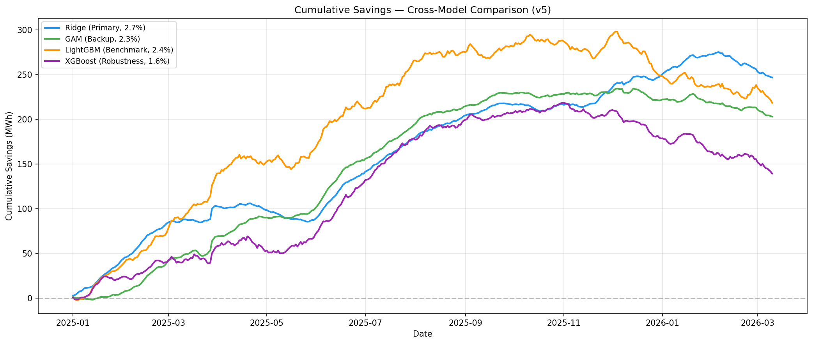

# ⚡ AC Energy Optimization — AI-Driven HVAC Intelligence

> A two-phase AI system: **Phase 1** detects room occupancy to drive smart HVAC control, **Phase 2** rigorously measures and verifies the energy savings using IPMVP-compliant baselines.

[](https://python.org)
[](https://lightgbm.readthedocs.io)
[]()
[]()
[]()
[](LICENSE)

---

## 📋 Table of Contents

- [Project Overview](#project-overview)
- [Phase 1 — Occupancy Detection & HVAC Control](#phase-1--occupancy-detection--hvac-control)
- [Phase 2 — Measurement & Verification (M&V)](#phase-2--measurement--verification-mv)
- [Repository Structure](#repository-structure)
- [Quick Start](#quick-start)
- [Documentation](#documentation)

---

## 🎯 Project Overview

This repository contains the complete AI-driven AC energy optimization pipeline for a commercial facility in Si Racha, Thailand:

| Phase | Goal | Primary Model | Key Metric |
|---|---|---|---|
| **Phase 1** | Detect room occupancy → Control HVAC | LightGBM (M1) | 98.4% Recall, 0.840 F1 |
| **Phase 2** | Measure & verify energy savings | Ridge Regression | 2.73% savings, NMBE = −0.67% |

```
Phase 1: "The Eyes & The Brain"          Phase 2: "The Proof"
┌─────────────────────────┐              ┌─────────────────────────┐
│  Sensor Data → AI Model │              │  Energy Data → Baseline │
│  → Occupancy Detection  │     ───►     │  → Counterfactual Pred  │
│  → HVAC Control Logic   │              │  → Verified Savings     │
│  → 5-State Setpoints    │              │  → Audit-Ready Report   │
└─────────────────────────┘              └─────────────────────────┘
```

---

## 🏨 Phase 1 — Occupancy Detection & HVAC Control

> **"The Eyes & The Brain"** — AI-driven room occupancy detection with intelligent HVAC control logic for The Seaview Grand hotel.

### Architecture

```
┌─────────────────────────────────────────────────────────┐
│                    SENSOR LAYER                          │
│  CO2 (ppm) │ Temp (°C) │ RH (%) │ Motion (events/5min)  │
└──────────────────────┬──────────────────────────────────┘
                       │
                       ▼
┌─────────────────────────────────────────────────────────┐
│               DATA PREPARATION                           │
│  Outlier detection (Rolling MAD) → Imputation → Splits   │
│  Feature Engineering (93 features incl. holiday/events)   │
└──────────────────────┬──────────────────────────────────┘
                       │
                       ▼
┌─────────────────────────────────────────────────────────┐
│             ROOM-TYPE ROUTING                            │
│  Regular (396) │ VIP Suite (82) │ Missing Sensor (4)     │
│  threshold=0.55│ threshold=0.40 │ threshold=0.45         │
└──────────────────────┬──────────────────────────────────┘
                       │
                       ▼
┌─────────────────────────────────────────────────────────┐
│          M1 LightGBM DETECTION + FORECAST                │
│  Detection: 25 RF-selected features, P(Occupied)         │
│  Forecast:  20 features, +30 min ahead probability       │
└──────────────────────┬──────────────────────────────────┘
                       │
                       ▼
┌─────────────────────────────────────────────────────────┐
│         5-STATE HVAC CONTROL LOGIC                       │
│  🟢 OCCUPIED → 🟠 STANDBY (+1°C) → 🟤 UNOCCUPIED (+3°C)│
│  → 🔴 DEEP SAVINGS (28°C) │ 🟡 PRE-COOL (forecast)     │
│  + Safety overrides: Sleep, VIP, Sensor failure          │
└─────────────────────────────────────────────────────────┘
```

### Key Results

#### Detection Benchmark (5 Models)

| Model | Architecture | Macro F1 | Recall (Occ) | Cohen κ | ROC-AUC |
|-------|-------------|:--------:|:------------:|:-------:|:-------:|
| **M0** | Threshold Rules | 0.755 | 0.975 | 0.522 | 0.921 |
| **M1** ✅ | LightGBM + RF | **0.840** | **0.984** | 0.683 | **0.974** |
| **M2** | PatchTST | 0.469 | 0.995 | 0.060 | 0.907 |
| **M3** | InceptionTime | **0.845** | 0.972 | **0.691** | 0.962 |
| **M4** | GAF-EfficientNet | 0.449 | 0.999 | 0.034 | 0.737 |

> ✅ **M1 LightGBM selected** for production: best forecast (Brier=0.105), 200× faster inference, no GPU required, fully interpretable.

#### Forecast Benchmark (+30 min ahead)

| Model | Brier ↓ | PR-AUC ↑ | Macro F1 | Cohen κ |
|-------|:-------:|:--------:|:--------:|:-------:|
| **M1** ✅ | **0.105** | **0.984** | **0.748** | **0.507** |
| M3 | 0.136 | 0.964 | 0.637 | 0.309 |
| M0 | 0.146 | 0.943 | 0.538 | 0.159 |

#### Business-Aligned Thresholds

| Room Type | Metric Optimized | Threshold | Score |
|-----------|------------------|:---------:|:-----:|
| Regular (396 rooms) | F0.5 (Unocc) — precision of "empty" calls | **0.55** | 0.854 |
| VIP Suite (82 rooms) | F2 (Occ) — recall of "occupied" calls | **0.40** | 0.965 |
| Missing Sensor (4 rooms) | F0.5 + Recall ≥ 0.95 | **0.45** | 0.740 |

### HVAC Control Logic

A graduated **5-state thermal drift strategy** aligned with ASHRAE Standards 55 & 36:

| State | Trigger | AC Setpoint | Recovery |
|-------|---------|-------------|:--------:|
| 🟢 **OCCUPIED** | Guest detected | Guest's choice | — |
| 🟡 **PRE-COOL** | Forecast: return in 30 min | 100% capacity | 0 min |
| 🟠 **STANDBY** | Empty < 60 min | +1°C | < 2 min |
| 🟤 **UNOCCUPIED** | Empty 1–12 hrs | +3°C | ~8 min |
| 🔴 **DEEP SAVINGS** | Empty > 12 hrs | 28°C cap | ~15 min |

#### Safety Overrides ("The Khun Somchai Rules")

| Edge Case | Rule |
|-----------|------|
| 🛏 **Sleeping guest** | Night + CO2 ≥ baseline → **Force OCCUPIED** |
| ⚠ **Sensor failure** | Route to degraded model. Confidence < 60% → **Force OCCUPIED** |
| 🏆 **VIP Suite** | Capped at STANDBY. Never enters UNOCCUPIED or DEEP SAVINGS |
| 🔌 **Total comm failure** | All sensors offline → **Immediate Force OCCUPIED** |

---

## ⚡ Phase 2 — Measurement & Verification (M&V)

> **"The Proof"** — Weather-adjusted baseline regression and savings estimation under IPMVP Option C.

### Architecture

```
┌─────────────────────────────────────────────────────────────┐
│                     DATA LAYER                               │
│  On-site BMS (4 columns) + Si Racha Weather (32 columns)     │
│  693 daily observations (May 2023 – Mar 2026)                │
└──────────────────────┬──────────────────────────────────────┘
                       │
                       ▼
┌─────────────────────────────────────────────────────────────┐
│               FEATURE ENGINEERING                            │
│  Wet-bulb temp │ CDD₂₄ │ is_weekend │ sin/cos_doy           │
│  Collinearity removal │ 8 configs tested │ NMBE-first        │
└──────────────────────┬──────────────────────────────────────┘
                       │
                       ▼
┌─────────────────────────────────────────────────────────────┐
│              MODEL TRAINING & VALIDATION                     │
│  Ridge (Primary) │ GAM (Backup) │ XGBoost │ LightGBM        │
│  + Chronos-2 & TimesFM foundation model experiments          │
│  ASHRAE Guideline 14 compliance │ Placebo test               │
└──────────────────────┬──────────────────────────────────────┘
                       │
                       ▼
┌─────────────────────────────────────────────────────────────┐
│             SAVINGS ESTIMATION                               │
│  Counterfactual: Predicted baseline − Actual metered         │
│  Primary: 2.73% │ Range: 1.56%–2.73% │ Cost: ~988k THB      │
└─────────────────────────────────────────────────────────────┘
```

### Key Results

| Metric | Value |
|---|---|
| **Primary model** | Ridge Regression (5 features, α = 100) |
| **Total energy saved** | **246,939 kWh** (over 15 months) |
| **Savings percentage** | **2.73%** |
| **Cross-model range** | 1.56% – 2.73% (4 independent architectures) |
| **Estimated cost savings** | ~988,000 THB (~$27,400 USD/year) |

#### Model Comparison

| Model | Role | Savings % | |NMBE| | CV(RMSE) | ASHRAE |
|---|---|---|---|---|---|
| **Ridge** | **Primary** | **2.73** | **0.67%** | 14.98% | ✅ |
| GAM | Backup | 2.26 | 1.73% | 14.06% | ✅ |
| LightGBM | Benchmark | 2.43 | 3.58% | 16.02% | ✅ |
| XGBoost | Robustness | 1.56 | 1.41% | 15.47% | ✅ |
| Ridge+TimesFM | Appendix | 1.85 | 1.88% | 6.74% | ✅ |

> **Ridge selected as primary** — lowest bias (NMBE = −0.67%), fully interpretable, trivially auditable.

#### Foundation Model Experiments

6 experiments tested Chronos-2 and TimesFM. All Chronos-2 variants failed catastrophically due to the 10-month data gap. Only TimesFM residual correction survived as an appendix model.

| Experiment | Model | Savings | Decision |
|---|---|---|---|
| A1 | Chronos-2 + covariates | −45.77% | ❌ Drop |
| A2 | Chronos-2 naive (120M) | −141.49% | ❌ Drop |
| B1 | Ridge + Chronos-2 resid | −143.48% | ❌ Drop |
| B2 | Ridge + TimesFM resid | **1.85%** | 📎 Appendix |

Full analysis: [Phase 2 FM Drop Analysis Report](phase2/docs/FM_Drop_Analysis_Report.md)

#### Cumulative Savings



---

## 📁 Repository Structure

```
AC-Energy-Optimization/
│
├── README.md                               # ★ This file (central overview)
│
├── phase1/                                 # Phase 1: Occupancy Detection
│   ├── .gitignore
│   ├── requirements.txt                    # Phase 1 dependencies
│   ├── control_logic/                      # HVAC control state machines
│   ├── data/external/                      # Thai holiday features
│   ├── docs/                               # Phase 1 reports & assets
│   │   ├── phase1_report.md
│   │   ├── data_dictionary.md
│   │   ├── control_logic.md
│   │   └── assets/                         # Phase 1 visualizations
│   ├── notebooks/                          # Phase 1 Jupyter notebooks
│   │   ├── 01_data_cleaning.ipynb
│   │   └── 02_eda_and_modeling.ipynb
│   └── src/                                # Phase 1 source code
│       ├── data_preparation.py
│       ├── feature_engineering.py
│       ├── eda_analysis.py
│       ├── models/                         # M0–M4 model pipelines
│       ├── evaluation/                     # Cross-model benchmarking
│       └── production/                     # Production inference
│
└── phase2/                                 # Phase 2: M&V Savings Analysis
    ├── README.md                           # Phase 2 detailed README
    ├── requirements.txt                    # Phase 2 dependencies
    ├── .gitignore                          # Phase 2 exclusions
    ├── notebooks/
    │   └── 01_baseline_and_savings.py      # ★ End-to-end M&V pipeline
    ├── src/
    │   ├── data_preparation.py             # Data loading & features
    │   ├── model_training.py               # Ridge, GAM, XGB training
    │   └── savings.py                      # Counterfactual calculation
    ├── docs/
    │   ├── Executive_Summary.md
    │   ├── Technical_Appendix.md
    │   ├── FM_Drop_Analysis_Report.md      # 25-page foundation model report
    │   └── assets/                         # Phase 2 visualizations
    └── models/
        ├── ridge_v5_coefficients.json      # Human-readable coefficients
        ├── training_metadata_v5.json       # Training metadata
        └── foundation_experiments_v5.json  # FM experiment results
```

---

## 🚀 Quick Start

### Phase 1 — Occupancy Detection

```bash
git clone https://github.com/Phasurab/AC-Energy-Optimization.git
cd AC-Energy-Optimization/phase1
pip install -r requirements.txt

# Run the pipeline
python src/data_preparation.py
python src/feature_engineering.py
python src/models/m1_lightgbm/pipeline.py
python src/evaluation/model_comparison.py
```

### Phase 2 — M&V Analysis

```bash
cd phase2
pip install -r requirements.txt

# Run the end-to-end M&V pipeline
python notebooks/01_baseline_and_savings.py
```

> **Note:** Raw data files and model weights are excluded via `.gitignore`. Contact the project owner for data access.

---

## 📂 Data

### Phase 1
- **53.3M** raw sensor rows from 482 rooms over 77 days
- 5-minute sampling interval: CO2, Temperature, Humidity, Motion
- 56.4% of presence labels corrupted (sensor disconnections)

### Phase 2
- **693** daily energy readings (May 2023 – Mar 2026)
- On-site BMS: 4 weather columns (dry-bulb, wet-bulb, RH)
- External Si Racha weather enrichment: 32 features

---

## 📄 Documentation

### Phase 1

| Document | Description |
|----------|-------------|
| [Phase 1 Report](phase1/docs/phase1_report.md) | Full technical report with all EDA, model results, and control logic |
| [Data Dictionary](phase1/docs/data_dictionary.md) | Sensor types, value ranges, and data structure |
| [Control Logic](phase1/docs/control_logic.md) | HVAC control strategy with mermaid flowcharts |

### Phase 2

| Document | Description |
|----------|-------------|
| [Phase 2 README](phase2/README.md) | Detailed Phase 2 setup and results |
| [Executive Summary](phase2/docs/Executive_Summary.md) | 1-page stakeholder summary |
| [Technical Appendix](phase2/docs/Technical_Appendix.md) | Full technical details |
| [FM Analysis Report](phase2/docs/FM_Drop_Analysis_Report.md) | 25-page foundation model assessment |

---

## 📚 References

| # | Reference | Phase |
|---|-----------|-------|
| 1 | ASHRAE Standard 55-2020 — Thermal Comfort | 1 & 2 |
| 2 | ASHRAE Guideline 14-2014 — M&V Calibration | 2 |
| 3 | IPMVP 2022 — Option C Whole-Facility | 2 |
| 4 | Das et al. (2025) — Chronos-2 | 2 |
| 5 | Das et al. (2024) — TimesFM | 2 |

---

## 📝 License

This project was developed as part of the AltoTech AI Engineer Assessment. Data is anonymized and derived from real deployments.

---

*Built with ❤️ for energy-efficient operations — from detection to verification*
