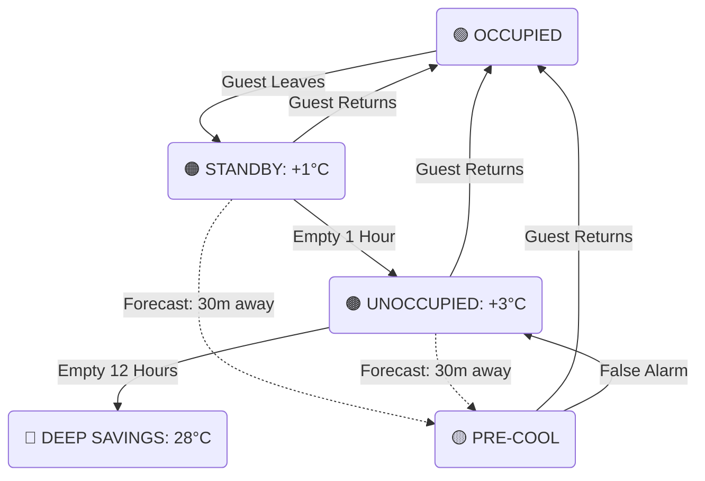

# Phase 1: From Detection to Action (HVAC Control Logic)

To translate our AI predictions into real HVAC commands, we use a 5-state control system. This system is designed around Khun Somchai's primary rule: **Energy savings are mandatory, but guest comfort is sacred.**

---

## 1. The 5-State Cooling Strategy

Instead of abruptly turning the AC off when a guest leaves, we gently drift the temperature upwards over time. This ensures that if a guest just stepped out for ice, they return to a perfectly cool room.

| State | Trigger Condition | AC Action (Set Point) | Purpose |
| :--- | :--- | :--- | :--- |
| 🟢 **OCCUPIED** | Guest is detected in the room | **Guest's Choice** (e.g. 23°C) | Total comfort |
| 🟡 **PRE-COOL** | Forecast predicts 30m away | **Guest's Choice** | Cool room before guest opens door |
| 🟠 **STANDBY** | Room empty < 1 Hour | **+1°C** drift (e.g. 24°C) | Barely noticeable savings |
| 🟤 **UNOCCUPIED** | Room empty 1 – 12 Hours | **+3°C** drift (e.g. 26°C) | Major energy savings |
| 🔴 **DEEP SAVINGS**| Room empty > 12 Hours | **28°C** max (Dehumidify) | Protect room from mold only |

### How It Flows 

---

## 2. Handling Guest Returns (Recovery)

**What happens when a guest returns to an empty room?**

*   **If Predicted (The VIP Treatment):** By using our 30-minute Forecast Model, the HVAC transitions to **PRE-COOL** before the guest even unlocks the door. The compressor spikes to 100% so the room perfectly hits the guest's set point precisely upon entry.
*   **If Unpredicted (Sudden Return):** The detection model instantly spots the guest and shifts the AC to **OCCUPIED**. Because the room was only allowed to drift slightly (+1°C to +3°C) rather than being fully shut off, it takes less than 10 minutes for the room to feel freezing cold again.

---

## 3. "The Khun Somchai Rules" (Edge Cases)

To ensure we never receive a complaint, the AI’s predictions are protected by a strict set of business rules (The "Gatekeeper").

### 🏆 Exception 1: VIP Suites
*   **The Risk:** VIPs pay a premium; they have zero tolerance for warm rooms.
*   **The Rule:** Suites use a highly aggressive model threshold (0.40) to make sure we never mistakenly think they are empty. Furthermore, **Suites are restricted from entering UNOCCUPIED or DEEP SAVINGS.** They are capped at STANDBY (+1°C max).

### 🛏️ Exception 2: Deep Sleep
*   **The Risk:** Guests sleeping motionless at 3:00 AM trick the motion sensor into thinking the room is empty, causing the AC to shut off and waking the guest up in a sweat.
*   **The Rule:** If it is nighttime, and the room's CO2 level is stable or slowly rising (simulating human breathing), the system **Force-Locks to OCCUPIED** regardless of the motion sensor.

### ⚠️ Exception 3: Broken Sensors Mid-Stay
*   **The Risk:** The motion sensor physically breaks while the guest is in the room. 
*   **The Rule:** The system immediately swaps to a degraded "Safe Model" that relies purely on CO2 and humidity. Because we know this data is missing, we lower the threshold. If the system is ever confused, it triggers the absolute fail-safe: **Force-Lock to OCCUPIED until Engineering fixes the sensor.**
